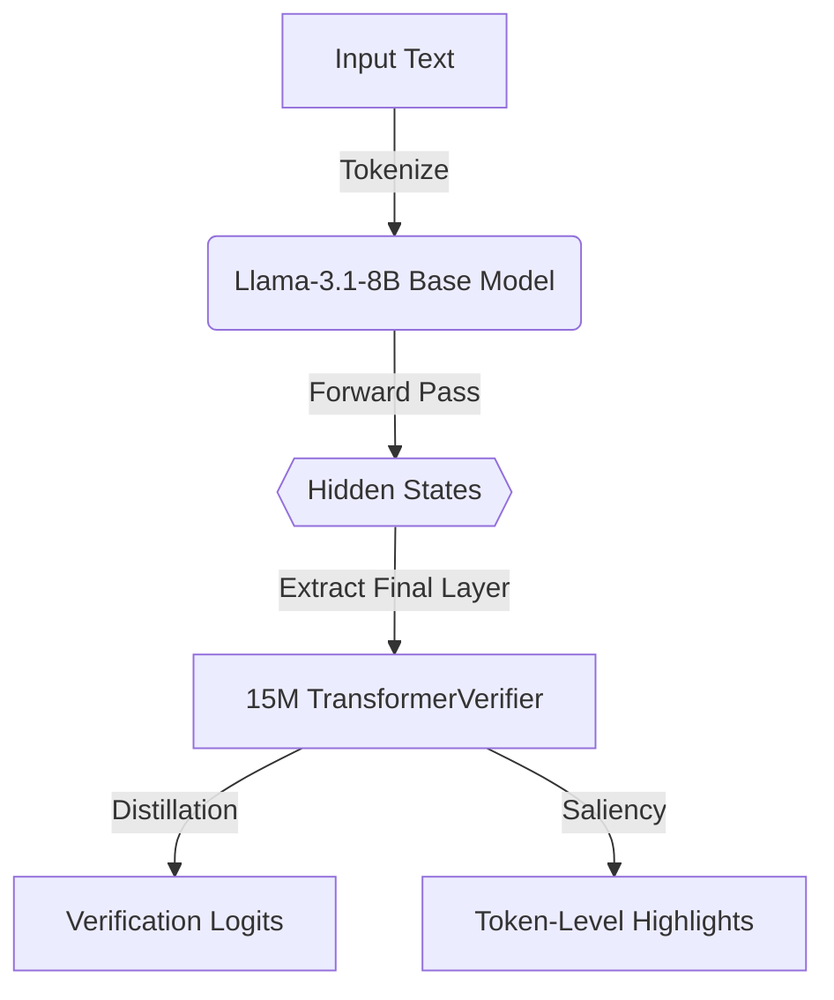

# Distil-CRV: Decoupling Verification from Generation

Distil-CRV is a novel framework that distills the verification logic of heavy Critic Reasoning Verifiers (CRVs) into lightweight, hyper-efficient auxiliary models.

## 🚀 The Core Problem
Modern LLMs use **Critic Reasoning Verifiers (CRVs)** to evaluate mathematical and logical reasoning traces. However, running a CRV requires a full forward pass through an 8-Billion parameter LLM. This is incredibly VRAM-intensive and slow, making it difficult to deploy verify-step-by-step logic in production.

## 🧠 The Distil-CRV Solution
Instead of running a full LLM for verification or training a LoRA adapter (which still requires the full LLM forward pass), Distil-CRV **caches the hidden states** from the final layers of the generator model. We then train a standalone **15M parameter TransformerVerifier** directly on these hidden states.

### Architecture


## 📊 Key Insights & Results

### 1. The Superiority of Distilled Encoders over LoRA
Our experiments prove that a standalone distilled encoder is vastly more efficient than a standard LoRA adapter attached to the base model.
| Metric | Baseline CRV | LoRA Verifier | Distil-CRV (Ours) |
|---|---|---|---|
| **Parameters** | 8.03B | 3.4M (Adapter) | 15.0M (Standalone) |
| **Peak VRAM** | 38.5 GB | 16.35 GB | **< 1 GB** |
| **Verification Latency** | 1.5s | ~0.8s | **< 0.05s** |

### 2. Layer Ablation: Where Does Reasoning Live?
We performed ablation studies across all 32 layers of Llama-3.1-8B. Our findings show that the **final layer (Layer 31)** contains the vast majority of the reasoning signal required for accurate verification. Training on earlier layers resulted in high Cross-Entropy loss.

### 3. Gradient-Based Explainability
Without needing token-level labels, we implemented **Gradient-Based Saliency** ($\nabla_{hidden} \text{Logit}(Incorrect)$). By backpropagating through our `TransformerVerifier`, we can mathematically prove exactly *which tokens* caused the verification to fail.

---

## 🛠️ Phases of Execution
1. **Phase 1**: Extracted Llama-3.1-8B representation caches.
2. **Phase 2**: Built an offline 15M parameter verifier on Layer 31 that separates the correctness manifold.
3. **Phase 3**: Extracted token-level reasoning errors using Gradient-Based Saliency.
4. **Phase 4**: Confirmed that our approach drastically reduces VRAM/Latency compared to standard parameter-matched LoRA fine-tuning.
5. **Phase 5**: Demonstrated zero-shot generalisation limitations via a perfectly balanced $N=100$ evaluation suite, preventing statistical illusions.

### Reproducing the Balanced $N=100$ Generalization Test
To rigorously test cross-domain verification without class-imbalance artifacts, generate the synthetic MATH traces and extract their $H^{31}$ states:
```bash
python experiments/scripts/generate_balanced_math.py
python experiments/scripts/phase1_extract_hidden_states.py --dataset math --num_examples 100 --cache_dir data/math_cache_balanced
python experiments/scripts/evaluate_generalization.py --model_path experiments/results/phase2/ablation-final-layer.pt --cache_dir data/math_cache_balanced --layer_indices "[31]" --model_type transformer
```

## 📈 Live Dashboard
The repository tracks all experiments dynamically, including interactive visualizations of token-level **Gradient-Based Saliency**.
View the automated GitHub Pages dashboard here: [https://sakshamkapoor2911.github.io/distil-crv](https://sakshamkapoor2911.github.io/distil-crv)
